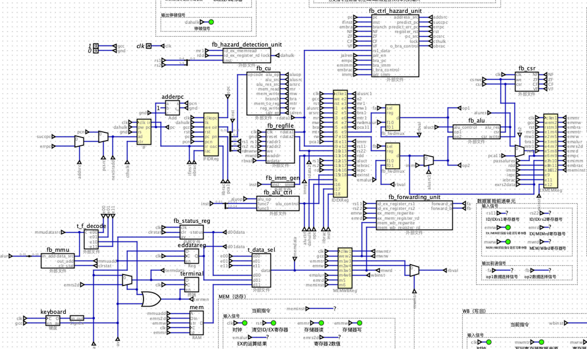

# RISCVFirebird

Firebird 是一个 RISC-V 架构的 CPU

仿真工具Digital：https://github.com/hneemann/Digital
RISC-V汇编器：https://github.com/TheThirdOne/rars


## 目录结构
``` bash
.
├── drawio              # 一些图片解释
├── examples            # 示例由Digital原作者给出
├── lib                 # 全局库
├── Pipeline            # 流水线CPU实现
├── SingleCycle         # 单周期CPU实现
├── Digital.jar         # Digital仿真工具 github:Digital  
├── rars_533d3c0.jar    # RISC-V汇编器 github:rars  
└── README.md       

```


## 单周期实现
单周期作为 CPU 设计的入门，单周期的处理器仅仅实现了 ld st beq add sub or and 指令。


## 流水线实现
实现了一个支持RISC-V整数指令集(RV32I)核心指令(不包括操作系统相关指令)的五级流水线处理器。
流水线划分为: IF(Instruction Fetch) / ID(Instruction Decode) / EX(Execute) / MEM(Memory) / WB(Write Back)
+ 能够正确处理指令间并行时冒险情况，包括数据冒险、结构冒险、控制冒险
+ 能够正确的进行静态分支预测，并进行分支预测的正确性判断
+ 能够正确的与仿真平台上的虚拟I/O设备通信
+ 能够运行用汇编语言编写的用户程序


## 未来研究
未来研究包括增加对虚拟内存的支持，与将成果移植至FPGA
